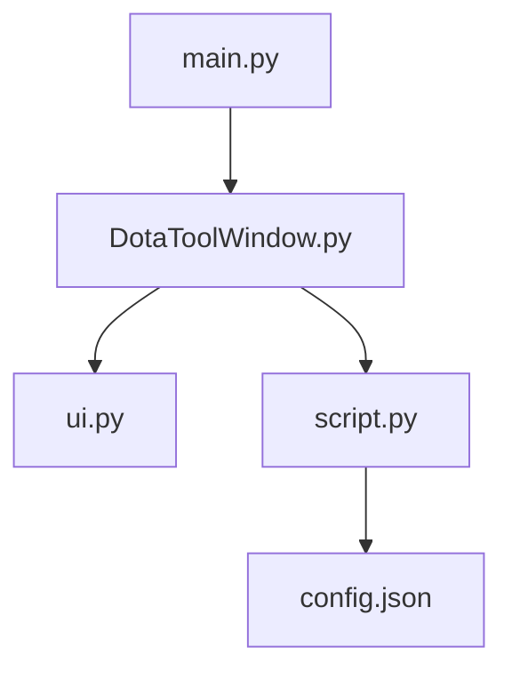

# Code Wiki：Dota Tool（Dota2 脚本编辑与 VPK 打包工具）

## 1. 项目概览

该仓库是一个基于 **PyQt5** 的桌面 GUI 工具，用于：

- 编辑 Dota2 的 KV 文本脚本（主要是英雄/单位/物品相关的 `*.txt`）
- 根据配置批量修改数值（经验/金钱倍数、中立物品掉落时间、特定物品属性等）
- 将生成的脚本目录打包为 `pak01_dir.vpk` 并投放到 Dota2 的 `game/mod/` 下
- 辅助操作：复制 steam 启动项 / bot 指令到剪贴板，快速打开常用路径，清理第三方换肤目录下的 vpk 文件等

从代码和资源结构看，它面向 Windows 环境（大量使用 `os.startfile`，并内置 `vpk.exe` + `*.dll` 与 `start.bat`）。

## 2. 技术栈与依赖

### 2.1 语言与框架

- Python 3
- GUI：PyQt5（入口创建 `QApplication` 并启动事件循环）

### 2.2 Python 依赖

- 见 [requirements.txt](file:///workspace/requirements.txt)
  - `pyperclip`：用于复制文本到剪贴板（脚本菜单“复制bot指令/复制steam启动项”）
  - `PyQt5_sip`：Qt 绑定支持库

说明：仓库代码实际使用 `PyQt5`（见 [main.py](file:///workspace/main.py)、[DotaToolWindow.py](file:///workspace/DotaToolWindow.py)），但 `requirements.txt` 未显式写入 `PyQt5`，需要在运行环境中自行安装。

### 2.3 外部工具/资源

- Valve VPK 工具链：见 [vpk/](file:///workspace/vpk)
  - [vpk.bat](file:///workspace/vpk/vpk.bat) 会调用 `vpk.exe pak01_dir` 生成 `pak01_dir.vpk`
- Dota2 安装目录与 bot 工作目录：通过 [config.json](file:///workspace/config.json) 配置

## 3. 仓库结构（Repository Layout）

```
/workspace
  main.py                 # GUI 入口（推荐）
  DotaToolWindow.py        # 主窗口类（也可直接运行）
  ui.py / ui.ui            # Qt Designer UI 与生成代码
  script.py                # 核心脚本能力（读写/批处理/VPK/路径工具）
  config.json              # 本机路径与批处理规则配置
  start.bat                # Windows 启动脚本（python main.py）

  npc/                     # 原始参考数据（Dota KV 文本）
    heroes/                # 英雄 KV（大量 npc_dota_hero_*.txt）
    npc_units.txt
    items.txt
    neutral_items.txt
    ...

  vpk/                     # VPK 工具与打包工作区
    vpk.exe + *.dll
    vpk.bat
    pak01_dir/             # 待打包目录（脚本会把输出写入这里）
      scripts/npc/
        items.txt
        npc_units.txt
        neutral_items.txt
        ...

  gi/                      # gameinfo 模板（用于 update_gi）
    gameinfo_branchspecific.gi
    gameinfo_branchspecific2.gi

  _install/                # 辅助数据/样例（当前未被 Python 代码引用）
```

核心逻辑集中在 3 个文件：

- GUI： [DotaToolWindow.py](file:///workspace/DotaToolWindow.py)
- UI 定义： [ui.py](file:///workspace/ui.py)
- 脚本能力： [script.py](file:///workspace/script.py)

## 4. 整体架构（Architecture）

该工具是典型的“GUI 前端 + 脚本后端 + 资源工作区”的结构。

### 4.1 组件关系

```mermaid
flowchart LR
  A[main.py\nQApplication 入口] --> B[DotaToolWindow\n(QMainWindow)]
  B --> C[Ui_MainWindow\n(ui.py)]
  B --> D[script.py\n工具/批处理/VPK]
  D --> E[config.json\n路径&规则]
  D --> F[npc/*\n原始KV数据]
  D --> G[vpk/pak01_dir/*\n打包工作区]
  D --> H[vpk/vpk.exe\n生成 pak01_dir.vpk]
  D --> I[Dota2 安装目录\n(game/mod, game/dota/...)]
```

### 4.2 两条主要业务流

**A. “编辑英雄 KV 并保存到打包工作区”**

- 用户在菜单中“载入”任意 `npc/heroes/*.txt`
- GUI 将文件按“行”加载进 `QListView`（`QStringListModel`）
- 用户通过“自动/单行/冷却/魔晶/魔杖/预设”等动作修改选中行的文本
- “保存”会将内容写入 `vpk/pak01_dir/scripts/npc/heroes/<同名文件>`（即打包工作区）

对应实现：

- 文件加载/保存： [DotaToolWindow.load/save](file:///workspace/DotaToolWindow.py#L90-L120)
- 编辑与批量模板更新： [DotaToolWindow.auto/oneline/cd/sa/sp/_update_ab1/_update_ab2](file:///workspace/DotaToolWindow.py#L176-L470)

**B. “批处理生成/更新 + 打包 VPK 并部署到 Dota2/mod”**

- “更新经验和金钱”：读取 `npc/npc_units.txt`，根据倍率规则，写入 `vpk/pak01_dir/scripts/npc/npc_units.txt`
- “更新中立物品时间”：读取 `npc/neutral_items.txt`，按时间列表替换，写入 `vpk/pak01_dir/scripts/npc/neutral_items.txt`
- “更新物品属性”：读取 `npc/items.txt`，按配置逐项替换，写入 `vpk/pak01_dir/scripts/npc/items.txt`
- “生成vpk文件”：执行 `vpk/vpk.bat` → 生成 `vpk/pak01_dir.vpk` → 移动到 `<dota_path>/game/mod/pak01_dir.vpk`

对应实现：

- 批处理： [update_xp_gold](file:///workspace/script.py#L71-L96)、[update_neutral_items](file:///workspace/script.py#L98-L122)、[update_items](file:///workspace/script.py#L124-L146)
- VPK 打包与部署： [generate_vpk](file:///workspace/script.py#L43-L53)

## 5. 模块职责（Modules）

### 5.1 main.py（应用入口）

- 负责初始化 Qt 应用与主窗口展示
- 入口极简： [main.py](file:///workspace/main.py)

### 5.2 DotaToolWindow.py（GUI：菜单、编辑器、动作绑定）

该模块提供 `DotaToolWindow(QMainWindow, Ui_MainWindow)`，承担：

- 初始化 UI、绑定菜单 action 到业务函数： [DotaToolWindow.init](file:///workspace/DotaToolWindow.py#L21-L89)
- 文件加载/保存/另存/打开： [load/reload/save/save_as/open](file:///workspace/DotaToolWindow.py#L90-L175)
- 行级编辑能力（剪切/粘贴/撤回/缩进/退格）： [cut/paste/undo/tab/back](file:///workspace/DotaToolWindow.py#L132-L170)
- 根据当前行内容生成“技能段落模板”的自动替换：
  - 处理一行内的 `"value"` 结构： [_update_ab1](file:///workspace/DotaToolWindow.py#L438-L452)
  - 处理块结构（含 `{ ... }`）： [_update_ab2](file:///workspace/DotaToolWindow.py#L453-L470)
- 脚本菜单：直接调用 `script.py` 中的函数（例如 `generate_vpk`, `update_xp_gold` 等）

重要实现细节：

- 通过 `from script import *` 引入 `script.py` 内部符号（包括 `os`、`path` 等）。因此 `DotaToolWindow.py` 自身未显式 `import os` 也能使用 `os.path.*`，依赖了 `import *` 的副作用（见文件顶部 [DotaToolWindow.py](file:///workspace/DotaToolWindow.py#L1-L6)）。

### 5.3 ui.py / ui.ui（UI 结构与菜单定义）

- [ui.ui](file:///workspace/ui.ui)：Qt Designer 源文件
- [ui.py](file:///workspace/ui.py)：由 `pyuic5` 生成的 UI 代码
- 主要内容包括：菜单栏/动作项（文件、编辑、操作、预设、窗口、脚本）以及核心编辑区域 `QListView`

### 5.4 script.py（后端能力：读写、批处理、VPK、路径工具）

该模块既包含通用 I/O，也包含 Dota2 相关的“更新规则”：

- 配置读写： [read_config/write_config](file:///workspace/script.py#L19-L29)
- 文本文件读写： [read_file/write_file](file:///workspace/script.py#L31-L41)
- VPK 生成与部署： [generate_vpk](file:///workspace/script.py#L43-L53)
- 批量更新：
  - 单位经验/金钱倍数： [update_xp_gold](file:///workspace/script.py#L71-L96)
  - 中立物品时间： [update_neutral_items](file:///workspace/script.py#L98-L122)
  - 物品属性： [update_items](file:///workspace/script.py#L124-L146)
- gameinfo 更新/重置： [update_gi](file:///workspace/script.py#L148-L158)
- 快捷打开与清理：`open_*`、[clean_all_skin](file:///workspace/script.py#L211-L218)

关键约束：

- `path = os.getcwd()`（见 [script.py](file:///workspace/script.py#L7)）意味着运行时应在仓库根目录启动，否则相对路径（`vpk/gi/npc` 等）会失效。
- `generate_vpk()` 通过 `subprocess.run(bat_path, shell=True)` 执行 bat（见 [script.py](file:///workspace/script.py#L43-L53)），强依赖 Windows shell 环境。

## 6. 关键类与函数说明（Key APIs）

### 6.1 DotaToolWindow（核心交互）

- `load()`：选取并加载 `npc/heroes/*.txt` 到列表模型 [DotaToolWindow.load](file:///workspace/DotaToolWindow.py#L90-L100)
- `save()`：保存到打包工作区 `vpk/pak01_dir/scripts/npc/heroes/` [DotaToolWindow.save](file:///workspace/DotaToolWindow.py#L110-L120)
- `auto()`：根据行内容智能选择 `_update_ab1/_update_ab2` 并替换 [DotaToolWindow.auto](file:///workspace/DotaToolWindow.py#L176-L195)
- `cd()/sa()/sp()`：以“冷却/魔晶/魔杖”规则更新行内容 [DotaToolWindow.cd](file:///workspace/DotaToolWindow.py#L205-L216)
- `_update_ab1/_update_ab2()`：把“某个 KV 行”格式化为含 `value/special_bonus_*` 的模板块 [DotaToolWindow._update_ab1](file:///workspace/DotaToolWindow.py#L438-L452)

### 6.2 script.py（批处理与系统操作）

- `generate_vpk()`：
  - 生成 `pak01_dir.vpk`（通过 `vpk/vpk.bat`）
  - 移动到 `<dota_path>/game/mod/pak01_dir.vpk`
  - 见 [script.generate_vpk](file:///workspace/script.py#L43-L53)
- `update_xp_gold()`：
  - 扫描 `npc/npc_units.txt` 中的 `BountyXP/BountyGoldMin/BountyGoldMax`
  - 用 `eval(val + xp_or_gold_expr)` 计算新值并写入工作区
  - 见 [script.update_xp_gold](file:///workspace/script.py#L71-L96)
- `update_neutral_items()`：
  - 将 `start_time` 依次替换为 `config.times` 列表
  - 将 `madstone_no_limit_time` 替换为最后一个时间点
  - 见 [script.update_neutral_items](file:///workspace/script.py#L98-L122)
- `update_items()`：
  - 按 `config.infos`（`[item_name, attr, new_val]`）逐项替换
  - 见 [script.update_items](file:///workspace/script.py#L124-L146)
- `update_gi(reset=False)`：
  - `reset=True`：写入 [gi/gameinfo_branchspecific.gi](file:///workspace/gi/gameinfo_branchspecific.gi)
  - `reset=False`：写入 [gi/gameinfo_branchspecific2.gi](file:///workspace/gi/gameinfo_branchspecific2.gi)
  - 目标路径为 `<dota_path>/game/dota/gameinfo_branchspecific.gi`
  - 见 [script.update_gi](file:///workspace/script.py#L148-L158)

## 7. 配置说明（config.json）

配置文件： [config.json](file:///workspace/config.json)

- `sa` / `sp`：用于 GUI “自动/单行”动作中生成的 shard/scepter 数值（例如 `+25%`, `+50%`）
- `sa_cd` / `sp_cd`：用于 “冷却”动作的 shard/scepter 数值（例如 `-25%`, `-50%`）
- `last_path`：GUI 关闭时保存最后打开的文件路径（见 [DotaToolWindow.closeEvent](file:///workspace/DotaToolWindow.py#L411-L416)）
- `dota_path`：Dota2 安装目录（用于写入 `game/mod`、打开目录、写入 gameinfo 等）
- `bot_path`：bot 工作目录（用于打开文件夹、打开 `OnEntityKilled.lua`）
- `bot_cmd` / `steam_cmd`：复制到剪贴板的命令文本
- `xp` / `gold`：经验与金钱的“表达式后缀”（例如 `*2`），由 `update_xp_gold()` 用 `eval` 执行
- `times`：中立物品掉落时间点列表（用于 `update_neutral_items()`）
- `infos`：物品属性替换规则列表（每项为 `[item_name, attr, new_val]`，用于 `update_items()`）

安全与可维护性提示：

- `xp/gold` 使用 `eval`（见 [script.update_xp_gold](file:///workspace/script.py#L71-L96)），请仅在可信环境编辑配置，避免注入任意表达式。

## 8. 运行与使用（Runbook）

### 8.1 安装依赖

在项目根目录执行：

```bash
pip install -r requirements.txt
pip install PyQt5
```

说明：第二行是对仓库现状的补充需求（代码依赖 PyQt5，但 requirements 未声明）。

### 8.2 启动方式

- 方式 1：直接运行入口脚本 [main.py](file:///workspace/main.py)

```bash
python main.py
```

- 方式 2（Windows）：运行 [start.bat](file:///workspace/start.bat)

### 8.3 使用流程建议

- 第一步：在 GUI 中 “载入” 一个英雄文件（例如 `npc/heroes/npc_dota_hero_*.txt`）
- 第二步：使用“自动/冷却/魔晶/魔杖/预设”等动作修改行内容
- 第三步：点击“保存”，文件会落到 `vpk/pak01_dir/scripts/npc/heroes/`（打包工作区）
- 第四步：按需运行脚本菜单：
  - 更新经验和金钱 / 中立物品时间 / 物品属性（生成或更新工作区里的主表）
  - 生成 vpk 文件（生成并部署到 `<dota_path>/game/mod/`）

### 8.4 平台限制

- `generate_vpk()` 通过 `.bat` 调用 `vpk.exe`（见 [vpk.bat](file:///workspace/vpk/vpk.bat) 与 [script.generate_vpk](file:///workspace/script.py#L43-L53)），默认面向 Windows。
- 大量 `open_*` 使用 `os.startfile`，同样是 Windows 特有 API。

## 9. 依赖关系与调用图（Dependencies）

### 9.1 Python 模块依赖



### 9.2 文件/目录依赖（运行时）

- 输入来源：
  - `npc/*.txt`（批处理的原始数据）
  - 用户选择的某个 `npc/heroes/*.txt`（GUI 载入编辑）
- 输出目标：
  - `vpk/pak01_dir/scripts/npc/*`（工作区、可被 vpk 打包）
  - `<dota_path>/game/mod/pak01_dir.vpk`（最终部署）
  - `<dota_path>/game/dota/gameinfo_branchspecific.gi`（update_gi 输出）

## 10. 常见问题（Troubleshooting）

- GUI 启动报 `ModuleNotFoundError: No module named 'PyQt5'`
  - 安装 `PyQt5`（见 8.1）
- “生成vpk文件”无输出或失败
  - 确认在 Windows 环境运行
  - 确认 `vpk/` 下的 `vpk.exe` 与 DLL 完整
  - 确认从仓库根目录启动（依赖 `os.getcwd()` 的相对路径）
- “打开xxx文件夹/文件”无反应
  - 该功能依赖 `os.startfile`，需要 Windows 桌面环境

